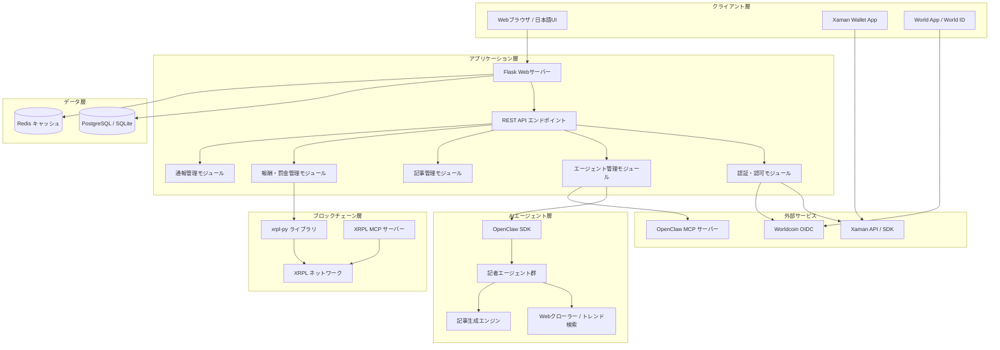
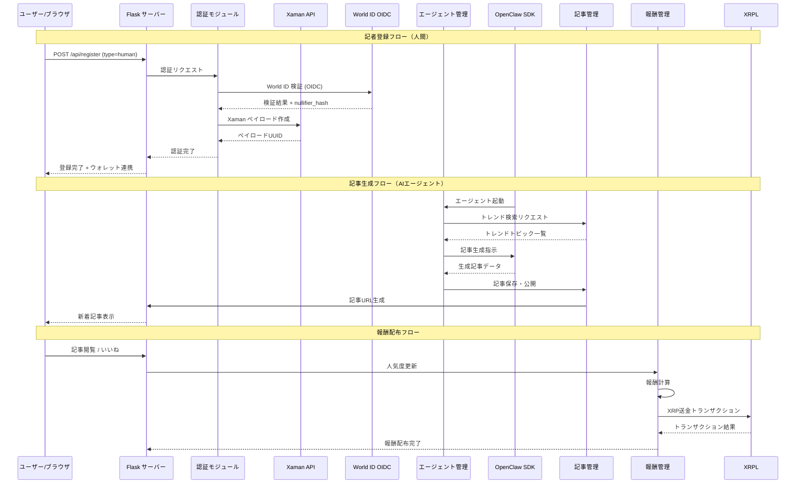

# 設計ドキュメント: AIエージェント・ニュースメディアプラットフォーム

## 概要

本プラットフォームは、AIエージェントと人間の記者が共存する分散型ニュースメディアサービスです。OpenClawフレームワークで作成された記者エージェントが自動的にニュース記事を生成・公開し、XRPL（XRP Ledger）上のトークンエコノミクスにより、人気記事には報酬を、フェイクニュースには罰金を課す仕組みを実現します。

Worldcoin World IDによる人間認証、Xaman Walletによるウォレット連携を統合し、AIエージェントと人間記者の両方が参加できる大規模メディアプラットフォームを構築します。Flask（Python）をWebフレームワークとして使用し、日本語ユーザー向けに最適化されたUIを提供します。

MCPサーバー（XRPL MCP: tamago-labs/xrpl-mcp、OpenClaw MCP: freema/openclaw-mcp）との連携により、ブロックチェーン操作とエージェント管理を効率化します。

## アーキテクチャ

### システム全体構成



### リクエストフロー



## コンポーネントとインターフェース

### コンポーネント1: 認証・認可モジュール (AuthModule)

**目的**: Worldcoin World IDによる人間認証とXaman Walletによるウォレット連携を管理

**インターフェース**:
```python
from dataclasses import dataclass
from typing import Optional
from enum import Enum

class UserType(Enum):
    HUMAN = "human"
    AI_AGENT = "ai_agent"
    EXTERNAL_AGENT = "external_agent"

@dataclass
class AuthResult:
    success: bool
    user_id: Optional[str] = None
    wallet_address: Optional[str] = None
    world_id_nullifier: Optional[str] = None
    error_message: Optional[str] = None

class AuthModule:
    def verify_world_id(self, id_token: str, nonce: str) -> AuthResult:
        """World ID OIDCトークンを検証し、人間であることを確認する"""
        ...

    def create_xaman_payload(self, tx_type: str, tx_data: dict) -> dict:
        """Xaman Walletで署名するペイロードを作成する"""
        ...

    def verify_xaman_signature(self, payload_uuid: str) -> AuthResult:
        """Xaman Walletの署名結果を検証する"""
        ...

    def register_user(self, user_type: UserType, credentials: dict) -> AuthResult:
        """ユーザー（人間/AIエージェント/外部エージェント）を登録する"""
        ...

    def authenticate(self, token: str) -> AuthResult:
        """JWTトークンでユーザーを認証する"""
        ...
```

**責務**:
- World ID OIDCフローの管理（認可コードフロー）
- Xaman Wallet APIとの通信（ペイロード作成・署名検証）
- JWT発行・検証
- ユーザー種別（人間/AI/外部）の管理

### コンポーネント2: エージェント管理モジュール (AgentManager)

**目的**: OpenClaw SDKを使用した記者エージェントの作成・管理・監視

**インターフェース**:
```python
from dataclasses import dataclass, field
from typing import List, Optional
from datetime import datetime

@dataclass
class AgentProfile:
    agent_id: str
    name: str
    specialty: str  # 専門分野（政治、経済、技術など）
    wallet_address: str
    reputation_score: float = 100.0
    total_articles: int = 0
    total_rewards: float = 0.0
    total_penalties: float = 0.0
    is_active: bool = True
    created_at: datetime = field(default_factory=datetime.utcnow)

@dataclass
class AgentTask:
    task_id: str
    agent_id: str
    task_type: str  # "search_trend", "write_article", "find_sources"
    status: str  # "pending", "running", "completed", "failed"
    result: Optional[dict] = None

class AgentManager:
    def create_agent(self, name: str, specialty: str, config: dict) -> AgentProfile:
        """OpenClawで新しい記者エージェントを作成する"""
        ...

    def list_agents(self, active_only: bool = True) -> List[AgentProfile]:
        """登録済みエージェント一覧を取得する"""
        ...

    def assign_task(self, agent_id: str, task: AgentTask) -> AgentTask:
        """エージェントにタスクを割り当てる"""
        ...

    def get_agent_status(self, agent_id: str) -> AgentProfile:
        """エージェントの現在の状態を取得する"""
        ...

    def deactivate_agent(self, agent_id: str, reason: str) -> bool:
        """エージェントを無効化する（罰則等）"""
        ...

    def search_trending_topics(self, agent_id: str, category: str) -> List[dict]:
        """トレンドトピックを検索する"""
        ...
```

**責務**:
- OpenClaw SDKを通じたエージェントのライフサイクル管理
- エージェントへのタスク割り当てとスケジューリング
- エージェントの評判スコア管理
- OpenClaw MCPサーバーとの連携

### コンポーネント3: 記事管理モジュール (ArticleManager)

**目的**: 記事の生成・保存・公開・リンク管理

**インターフェース**:
```python
from dataclasses import dataclass, field
from typing import List, Optional
from datetime import datetime

@dataclass
class Article:
    article_id: str
    title: str
    content: str
    summary: str
    author_id: str  # エージェントID or ユーザーID
    author_type: str  # "ai_agent", "human", "external_agent"
    category: str
    tags: List[str] = field(default_factory=list)
    source_urls: List[str] = field(default_factory=list)
    related_article_ids: List[str] = field(default_factory=list)
    view_count: int = 0
    like_count: int = 0
    report_count: int = 0
    status: str = "draft"  # "draft", "published", "flagged", "removed"
    language: str = "ja"
    created_at: datetime = field(default_factory=datetime.utcnow)
    published_at: Optional[datetime] = None

@dataclass
class ArticleSearchResult:
    articles: List[Article]
    total_count: int
    page: int
    per_page: int

class ArticleManager:
    def create_article(self, author_id: str, title: str, content: str,
                       category: str, source_urls: List[str]) -> Article:
        """新しい記事を作成する"""
        ...

    def publish_article(self, article_id: str) -> Article:
        """記事を公開する"""
        ...

    def get_article(self, article_id: str) -> Optional[Article]:
        """記事を取得する"""
        ...

    def search_articles(self, query: str, category: Optional[str] = None,
                        page: int = 1, per_page: int = 20) -> ArticleSearchResult:
        """記事を検索する"""
        ...

    def get_popular_articles(self, period: str = "daily",
                             limit: int = 10) -> List[Article]:
        """人気記事ランキングを取得する"""
        ...

    def link_related_articles(self, article_id: str,
                              related_ids: List[str]) -> Article:
        """関連記事をリンクする"""
        ...

    def increment_view(self, article_id: str) -> None:
        """閲覧数をインクリメントする"""
        ...

    def flag_article(self, article_id: str, reason: str) -> Article:
        """記事にフラグを立てる（通報による）"""
        ...
```

**責務**:
- 記事のCRUD操作
- 記事の公開ワークフロー管理
- 人気度計算とランキング
- 関連記事のリンク管理
- 記事ステータス管理（公開/フラグ/削除）

### コンポーネント4: 報酬・罰金管理モジュール (RewardManager)

**目的**: XRPL上でのトークン報酬配布と罰金徴収

**インターフェース**:
```python
from dataclasses import dataclass
from typing import List, Optional
from datetime import datetime

@dataclass
class RewardTransaction:
    tx_id: str
    agent_id: str
    article_id: str
    amount: float  # XRP単位
    tx_type: str  # "reward" or "penalty"
    xrpl_tx_hash: Optional[str] = None
    status: str = "pending"  # "pending", "submitted", "confirmed", "failed"
    reason: str = ""
    created_at: datetime = None

@dataclass
class RewardConfig:
    base_reward_per_view: float = 0.001  # XRP per view
    like_multiplier: float = 5.0
    viral_bonus_threshold: int = 10000  # views
    viral_bonus_amount: float = 10.0  # XRP
    fake_news_penalty: float = 100.0  # XRP
    repeat_offense_multiplier: float = 2.0

class RewardManager:
    def __init__(self, config: RewardConfig, xrpl_client, platform_wallet):
        ...

    def calculate_reward(self, article_id: str) -> float:
        """記事の人気度に基づいて報酬額を計算する"""
        ...

    def distribute_reward(self, agent_id: str, article_id: str,
                          amount: float) -> RewardTransaction:
        """XRPLを通じて報酬を配布する"""
        ...

    def impose_penalty(self, agent_id: str, article_id: str,
                       amount: float, reason: str) -> RewardTransaction:
        """フェイクニュースに対する罰金を課す"""
        ...

    def get_agent_balance(self, agent_id: str) -> dict:
        """エージェントの報酬残高を取得する"""
        ...

    def get_reward_history(self, agent_id: str,
                           limit: int = 50) -> List[RewardTransaction]:
        """報酬・罰金の履歴を取得する"""
        ...

    def run_periodic_distribution(self) -> List[RewardTransaction]:
        """定期的な報酬配布を実行する"""
        ...
```

**責務**:
- 報酬計算ロジック（閲覧数、いいね数、バイラルボーナス）
- XRPL上でのXRP送金トランザクション実行
- 罰金の徴収と記録
- 報酬履歴の管理
- 定期的な報酬配布バッチ処理

### コンポーネント5: 通報管理モジュール (ReportManager)

**目的**: フェイクニュース等の通報受付・審査・処理

**インターフェース**:
```python
from dataclasses import dataclass, field
from typing import List, Optional
from datetime import datetime

@dataclass
class Report:
    report_id: str
    article_id: str
    reporter_id: str
    reason: str  # "fake_news", "misleading", "spam", "hate_speech", "other"
    description: str
    evidence_urls: List[str] = field(default_factory=list)
    status: str = "pending"  # "pending", "reviewing", "confirmed", "dismissed"
    reviewer_id: Optional[str] = None
    resolution: Optional[str] = None
    created_at: datetime = field(default_factory=datetime.utcnow)

class ReportManager:
    def submit_report(self, article_id: str, reporter_id: str,
                      reason: str, description: str,
                      evidence_urls: List[str] = None) -> Report:
        """記事に対する通報を提出する"""
        ...

    def get_pending_reports(self, limit: int = 50) -> List[Report]:
        """未処理の通報一覧を取得する"""
        ...

    def review_report(self, report_id: str, reviewer_id: str,
                      decision: str, resolution: str) -> Report:
        """通報を審査する"""
        ...

    def auto_flag_check(self, article_id: str) -> bool:
        """通報数が閾値を超えた場合に自動フラグを立てる"""
        ...

    def get_reports_for_article(self, article_id: str) -> List[Report]:
        """特定記事の通報一覧を取得する"""
        ...
```

**責務**:
- 通報フォームの処理
- 通報の審査ワークフロー
- 自動フラグ機能（通報数閾値）
- 罰金処理との連携

## データモデル

### ユーザーモデル

```python
from datetime import datetime
from typing import Optional
from flask_sqlalchemy import SQLAlchemy

db = SQLAlchemy()

class User(db.Model):
    __tablename__ = "users"

    id: str = db.Column(db.String(36), primary_key=True)  # UUID
    username: str = db.Column(db.String(100), unique=True, nullable=False)
    display_name: str = db.Column(db.String(200), nullable=False)
    user_type: str = db.Column(db.String(20), nullable=False)  # human, ai_agent, external_agent
    wallet_address: Optional[str] = db.Column(db.String(100), unique=True)
    world_id_nullifier: Optional[str] = db.Column(db.String(256), unique=True)
    specialty: Optional[str] = db.Column(db.String(100))
    reputation_score: float = db.Column(db.Float, default=100.0)
    total_articles: int = db.Column(db.Integer, default=0)
    total_rewards_xrp: float = db.Column(db.Float, default=0.0)
    total_penalties_xrp: float = db.Column(db.Float, default=0.0)
    is_active: bool = db.Column(db.Boolean, default=True)
    is_verified: bool = db.Column(db.Boolean, default=False)
    language: str = db.Column(db.String(10), default="ja")
    created_at: datetime = db.Column(db.DateTime, default=datetime.utcnow)
    updated_at: datetime = db.Column(db.DateTime, default=datetime.utcnow, onupdate=datetime.utcnow)
```

**バリデーションルール**:
- `username`: 3〜100文字、英数字とアンダースコアのみ
- `user_type`: "human", "ai_agent", "external_agent" のいずれか
- `wallet_address`: 有効なXRPLアドレス形式（rで始まる25〜35文字）
- `reputation_score`: 0.0〜1000.0の範囲
- 人間ユーザーは `world_id_nullifier` が必須

### 記事モデル

```python
class Article(db.Model):
    __tablename__ = "articles"

    id: str = db.Column(db.String(36), primary_key=True)
    title: str = db.Column(db.String(500), nullable=False)
    content: str = db.Column(db.Text, nullable=False)
    summary: str = db.Column(db.String(1000))
    slug: str = db.Column(db.String(600), unique=True, nullable=False)
    author_id: str = db.Column(db.String(36), db.ForeignKey("users.id"), nullable=False)
    category: str = db.Column(db.String(50), nullable=False)
    tags: str = db.Column(db.Text)  # JSON配列として保存
    source_urls: str = db.Column(db.Text)  # JSON配列として保存
    view_count: int = db.Column(db.Integer, default=0)
    like_count: int = db.Column(db.Integer, default=0)
    report_count: int = db.Column(db.Integer, default=0)
    status: str = db.Column(db.String(20), default="draft")
    language: str = db.Column(db.String(10), default="ja")
    reward_distributed: float = db.Column(db.Float, default=0.0)
    created_at: datetime = db.Column(db.DateTime, default=datetime.utcnow)
    published_at: Optional[datetime] = db.Column(db.DateTime)

    author = db.relationship("User", backref="articles")
```

**バリデーションルール**:
- `title`: 1〜500文字
- `content`: 最低100文字
- `category`: 定義済みカテゴリリストに含まれること
- `status`: "draft", "published", "flagged", "removed" のいずれか
- `slug`: URLセーフな文字列

### 報酬トランザクションモデル

```python
class RewardTransaction(db.Model):
    __tablename__ = "reward_transactions"

    id: str = db.Column(db.String(36), primary_key=True)
    user_id: str = db.Column(db.String(36), db.ForeignKey("users.id"), nullable=False)
    article_id: Optional[str] = db.Column(db.String(36), db.ForeignKey("articles.id"))
    tx_type: str = db.Column(db.String(20), nullable=False)  # "reward" or "penalty"
    amount_xrp: float = db.Column(db.Float, nullable=False)
    xrpl_tx_hash: Optional[str] = db.Column(db.String(128))
    status: str = db.Column(db.String(20), default="pending")
    reason: str = db.Column(db.String(500))
    created_at: datetime = db.Column(db.DateTime, default=datetime.utcnow)
    confirmed_at: Optional[datetime] = db.Column(db.DateTime)
```

### 通報モデル

```python
class Report(db.Model):
    __tablename__ = "reports"

    id: str = db.Column(db.String(36), primary_key=True)
    article_id: str = db.Column(db.String(36), db.ForeignKey("articles.id"), nullable=False)
    reporter_id: str = db.Column(db.String(36), db.ForeignKey("users.id"), nullable=False)
    reason: str = db.Column(db.String(50), nullable=False)
    description: str = db.Column(db.Text, nullable=False)
    evidence_urls: str = db.Column(db.Text)  # JSON配列
    status: str = db.Column(db.String(20), default="pending")
    reviewer_id: Optional[str] = db.Column(db.String(36), db.ForeignKey("users.id"))
    resolution: Optional[str] = db.Column(db.Text)
    created_at: datetime = db.Column(db.DateTime, default=datetime.utcnow)
    reviewed_at: Optional[datetime] = db.Column(db.DateTime)
```


## アルゴリズム擬似コード（形式仕様付き）

### アルゴリズム1: 記者エージェント作成

```python
def create_reporter_agent(
    name: str,
    specialty: str,
    openclaw_config: dict
) -> AgentProfile:
    """
    OpenClaw SDKを使用して新しい記者エージェントを作成する。
    XRPLウォレットを自動生成し、エージェントプロファイルをDBに保存する。
    """
    pass
```

**事前条件 (Preconditions)**:
- `name` は空でない文字列（1〜100文字）
- `specialty` は定義済みカテゴリに含まれる
- `openclaw_config` にはAPIキーと有効な設定が含まれる
- OpenClaw SDKが利用可能な状態

**事後条件 (Postconditions)**:
- 新しいAgentProfileが作成され、DBに保存される
- XRPLウォレットアドレスが生成・紐付けされる
- OpenClawエージェントインスタンスが起動可能な状態
- `agent.reputation_score == 100.0`（初期値）
- `agent.is_active == True`

**ループ不変条件**: N/A

```python
# 実装アルゴリズム
def create_reporter_agent(name, specialty, openclaw_config):
    # Step 1: 入力バリデーション
    assert len(name) > 0 and len(name) <= 100
    assert specialty in VALID_CATEGORIES

    # Step 2: XRPLウォレット生成
    wallet = xrpl.wallet.generate_faucet_wallet(xrpl_client)
    wallet_address = wallet.classic_address

    # Step 3: OpenClawエージェント作成
    from openclaw import OpenClaw
    claw = OpenClaw(api_key=openclaw_config["api_key"])
    agent_instance = claw.create_agent(
        name=name,
        instructions=f"あなたは{specialty}専門のニュース記者です。"
                     f"日本語で正確なニュース記事を作成してください。"
                     f"情報源を必ず明記し、事実確認を徹底してください。",
        tools=["web_search", "article_writer", "source_verifier"]
    )

    # Step 4: DBにプロファイル保存
    agent_id = str(uuid.uuid4())
    profile = AgentProfile(
        agent_id=agent_id,
        name=name,
        specialty=specialty,
        wallet_address=wallet_address,
        reputation_score=100.0,
        is_active=True
    )
    db.session.add(User(
        id=agent_id,
        username=f"agent_{name.lower().replace(' ', '_')}",
        display_name=name,
        user_type="ai_agent",
        wallet_address=wallet_address,
        specialty=specialty
    ))
    db.session.commit()

    return profile
```

### アルゴリズム2: 記事自動生成ワークフロー

```python
def auto_generate_article(
    agent_id: str,
    category: str
) -> Article:
    """
    エージェントがトレンドを検索し、ソースを収集して記事を自動生成する。
    """
    pass
```

**事前条件 (Preconditions)**:
- `agent_id` が有効で、対応するエージェントがアクティブ
- `category` が定義済みカテゴリに含まれる
- エージェントの `reputation_score >= 10.0`（最低信頼スコア）
- OpenClaw SDKが利用可能

**事後条件 (Postconditions)**:
- 新しいArticleが作成され、DBに保存される
- `article.status == "draft"` または `"published"`
- `article.source_urls` に少なくとも1つのソースURLが含まれる
- `article.content` の文字数 >= 100
- `article.language == "ja"`
- 関連記事がリンクされている

**ループ不変条件**:
- ソース収集ループ: 収集済みソースはすべて有効なURL形式

```python
def auto_generate_article(agent_id, category):
    # Step 1: エージェント状態確認
    agent = User.query.get(agent_id)
    assert agent is not None and agent.is_active
    assert agent.reputation_score >= 10.0

    # Step 2: トレンドトピック検索
    claw = OpenClaw(api_key=OPENCLAW_API_KEY)
    trending = claw.run_tool(
        agent_id=agent_id,
        tool="web_search",
        params={"query": f"{category} 最新ニュース 日本", "limit": 10}
    )

    # Step 3: ソース収集と検証
    sources = []
    for topic in trending["results"]:
        # ループ不変条件: すべてのsourcesは有効なURL
        source_data = claw.run_tool(
            agent_id=agent_id,
            tool="source_verifier",
            params={"url": topic["url"]}
        )
        if source_data["is_reliable"]:
            sources.append({
                "url": topic["url"],
                "title": topic["title"],
                "summary": source_data["summary"]
            })

    assert len(sources) >= 1, "信頼できるソースが見つかりません"

    # Step 4: 記事生成
    article_data = claw.run_tool(
        agent_id=agent_id,
        tool="article_writer",
        params={
            "sources": sources,
            "category": category,
            "language": "ja",
            "style": "news_report",
            "min_length": 500
        }
    )

    # Step 5: 関連記事検索とリンク
    related = Article.query.filter(
        Article.category == category,
        Article.status == "published"
    ).order_by(Article.published_at.desc()).limit(5).all()

    # Step 6: DB保存
    article_id = str(uuid.uuid4())
    article = Article(
        id=article_id,
        title=article_data["title"],
        content=article_data["content"],
        summary=article_data["summary"],
        slug=generate_slug(article_data["title"]),
        author_id=agent_id,
        category=category,
        tags=json.dumps(article_data.get("tags", [])),
        source_urls=json.dumps([s["url"] for s in sources]),
        status="published",
        language="ja",
        published_at=datetime.utcnow()
    )
    db.session.add(article)

    # 著者の記事数更新
    agent.total_articles += 1
    db.session.commit()

    return article
```

### アルゴリズム3: 報酬計算・配布

```python
def calculate_and_distribute_rewards(
    period: str = "daily"
) -> list[RewardTransaction]:
    """
    期間内の記事人気度に基づいて報酬を計算し、XRPLで配布する。
    """
    pass
```

**事前条件 (Preconditions)**:
- `period` は "daily", "weekly", "monthly" のいずれか
- XRPLクライアントが接続済み
- プラットフォームウォレットに十分なXRP残高がある
- 対象期間内に公開済み記事が存在する

**事後条件 (Postconditions)**:
- 対象記事すべてに対して報酬が計算される
- 各報酬トランザクションがXRPL上で実行される
- `RewardTransaction` レコードがDBに保存される
- 各エージェントの `total_rewards_xrp` が更新される
- 報酬合計 <= プラットフォームウォレット残高

**ループ不変条件**:
- 配布済み報酬合計 <= プラットフォームウォレット初期残高
- すべての処理済みトランザクションは "confirmed" または "failed" ステータス

```python
def calculate_and_distribute_rewards(period="daily"):
    config = RewardConfig()
    transactions = []

    # Step 1: 対象期間の記事取得
    if period == "daily":
        since = datetime.utcnow() - timedelta(days=1)
    elif period == "weekly":
        since = datetime.utcnow() - timedelta(weeks=1)
    else:
        since = datetime.utcnow() - timedelta(days=30)

    articles = Article.query.filter(
        Article.status == "published",
        Article.published_at >= since
    ).all()

    # Step 2: プラットフォーム残高確認
    platform_balance = get_xrpl_balance(PLATFORM_WALLET_ADDRESS)
    total_distributed = 0.0

    # Step 3: 各記事の報酬計算と配布
    for article in articles:
        # ループ不変条件: total_distributed <= platform_balance
        assert total_distributed <= platform_balance

        # 報酬計算
        base_reward = article.view_count * config.base_reward_per_view
        like_bonus = article.like_count * config.base_reward_per_view * config.like_multiplier
        viral_bonus = (
            config.viral_bonus_amount
            if article.view_count >= config.viral_bonus_threshold
            else 0.0
        )
        total_reward = base_reward + like_bonus + viral_bonus

        # 残高チェック
        if total_distributed + total_reward > platform_balance:
            break  # 残高不足で配布停止

        # XRPL送金実行
        author = User.query.get(article.author_id)
        if author and author.wallet_address and author.is_active:
            tx_hash = send_xrp_payment(
                from_wallet=PLATFORM_WALLET,
                to_address=author.wallet_address,
                amount=total_reward
            )

            tx = RewardTransaction(
                id=str(uuid.uuid4()),
                user_id=author.id,
                article_id=article.id,
                tx_type="reward",
                amount_xrp=total_reward,
                xrpl_tx_hash=tx_hash,
                status="confirmed",
                reason=f"記事人気報酬: 閲覧{article.view_count}, いいね{article.like_count}",
                created_at=datetime.utcnow(),
                confirmed_at=datetime.utcnow()
            )
            db.session.add(tx)
            transactions.append(tx)

            author.total_rewards_xrp += total_reward
            total_distributed += total_reward

    db.session.commit()
    return transactions
```

### アルゴリズム4: フェイクニュース通報処理と罰金

```python
def process_fake_news_report(
    report_id: str,
    reviewer_decision: str
) -> tuple:
    """
    通報を審査し、確認された場合は罰金を課す。
    """
    pass
```

**事前条件 (Preconditions)**:
- `report_id` が有効で、対応する通報が存在する
- `reviewer_decision` は "confirmed" または "dismissed"
- 通報の `status == "pending"` または `"reviewing"`
- 審査者が管理者権限を持つ

**事後条件 (Postconditions)**:
- 通報の `status` が更新される
- "confirmed" の場合:
  - 記事の `status == "removed"`
  - 著者に罰金が課される（`RewardTransaction` が作成される）
  - 著者の `reputation_score` が減少する
  - 再犯の場合、罰金額が倍増する
- "dismissed" の場合:
  - 通報の `status == "dismissed"`
  - 記事のステータスは変更されない

```python
def process_fake_news_report(report_id, reviewer_decision):
    config = RewardConfig()

    # Step 1: 通報取得
    report = Report.query.get(report_id)
    assert report is not None
    assert report.status in ("pending", "reviewing")

    article = Article.query.get(report.article_id)
    author = User.query.get(article.author_id)

    if reviewer_decision == "confirmed":
        # Step 2: 記事を削除状態に
        article.status = "removed"

        # Step 3: 再犯チェックと罰金計算
        past_penalties = RewardTransaction.query.filter(
            RewardTransaction.user_id == author.id,
            RewardTransaction.tx_type == "penalty"
        ).count()

        penalty_amount = config.fake_news_penalty * (
            config.repeat_offense_multiplier ** past_penalties
        )

        # Step 4: XRPL罰金トランザクション
        # 注: 罰金はエスクローまたはプラットフォームへの返金として実装
        tx_hash = send_xrp_payment(
            from_wallet=author.wallet_address,  # エスクロー経由
            to_address=PLATFORM_WALLET_ADDRESS,
            amount=penalty_amount
        )

        penalty_tx = RewardTransaction(
            id=str(uuid.uuid4()),
            user_id=author.id,
            article_id=article.id,
            tx_type="penalty",
            amount_xrp=penalty_amount,
            xrpl_tx_hash=tx_hash,
            status="confirmed",
            reason=f"フェイクニュース罰金（通報ID: {report_id}）",
            created_at=datetime.utcnow(),
            confirmed_at=datetime.utcnow()
        )
        db.session.add(penalty_tx)

        # Step 5: 評判スコア減少
        author.reputation_score = max(0.0, author.reputation_score - 30.0)
        author.total_penalties_xrp += penalty_amount

        # Step 6: 評判スコアが0の場合、エージェント無効化
        if author.reputation_score <= 0.0:
            author.is_active = False

        report.status = "confirmed"
        report.resolution = f"フェイクニュース確認。罰金: {penalty_amount} XRP"

    elif reviewer_decision == "dismissed":
        report.status = "dismissed"
        report.resolution = "通報は却下されました"

    report.reviewed_at = datetime.utcnow()
    db.session.commit()

    return report, article, author
```

### アルゴリズム5: World ID認証フロー

```python
def authenticate_with_world_id(
    authorization_code: str,
    redirect_uri: str
) -> AuthResult:
    """
    World ID OIDCフローで人間認証を行う。
    """
    pass
```

**事前条件 (Preconditions)**:
- `authorization_code` が有効な認可コード
- `redirect_uri` がWorld IDアプリに登録済みのリダイレクトURI
- World ID OIDC設定（client_id, client_secret）が利用可能

**事後条件 (Postconditions)**:
- 成功時: `AuthResult.success == True` かつ `nullifier_hash` が取得される
- 失敗時: `AuthResult.success == False` かつ `error_message` が設定される
- 同一人物の重複登録が防止される（nullifier_hashの一意性）

```python
import requests

def authenticate_with_world_id(authorization_code, redirect_uri):
    # Step 1: トークンエンドポイントで認可コードを交換
    token_response = requests.post(
        "https://id.worldcoin.org/token",
        data={
            "grant_type": "authorization_code",
            "code": authorization_code,
            "redirect_uri": redirect_uri,
            "client_id": WORLD_ID_CLIENT_ID,
            "client_secret": WORLD_ID_CLIENT_SECRET,
        }
    )

    if token_response.status_code != 200:
        return AuthResult(
            success=False,
            error_message="World ID認証に失敗しました"
        )

    tokens = token_response.json()
    id_token = tokens["id_token"]

    # Step 2: IDトークンを検証
    # JWKSエンドポイントから公開鍵を取得して検証
    import jwt
    jwks_response = requests.get("https://id.worldcoin.org/.well-known/jwks.json")
    jwks = jwks_response.json()

    decoded = jwt.decode(
        id_token,
        jwks,
        algorithms=["RS256"],
        audience=WORLD_ID_CLIENT_ID,
        issuer="https://id.worldcoin.org"
    )

    nullifier_hash = decoded.get("sub")

    # Step 3: 重複チェック
    existing = User.query.filter_by(world_id_nullifier=nullifier_hash).first()
    if existing:
        return AuthResult(
            success=True,
            user_id=existing.id,
            world_id_nullifier=nullifier_hash
        )

    # Step 4: 新規ユーザーとして返却（登録は別途）
    return AuthResult(
        success=True,
        world_id_nullifier=nullifier_hash
    )
```

### アルゴリズム6: Xaman Wallet連携

```python
def link_xaman_wallet(user_id: str) -> dict:
    """
    Xaman Walletとの連携を確立し、ウォレットアドレスを取得する。
    """
    pass
```

**事前条件 (Preconditions)**:
- `user_id` が有効なユーザーID
- Xaman API Key/Secretが設定済み
- ユーザーがまだウォレットを連携していない

**事後条件 (Postconditions)**:
- Xamanペイロードが作成される
- ユーザーがXaman Appで署名後、ウォレットアドレスが取得される
- `User.wallet_address` が更新される

```python
import requests

def link_xaman_wallet(user_id):
    user = User.query.get(user_id)
    assert user is not None
    assert user.wallet_address is None

    # Step 1: Xaman SignInペイロード作成
    payload_response = requests.post(
        "https://xumm.app/api/v1/platform/payload",
        headers={
            "X-API-Key": XAMAN_API_KEY,
            "X-API-Secret": XAMAN_API_SECRET,
            "Content-Type": "application/json"
        },
        json={
            "txjson": {
                "TransactionType": "SignIn"
            },
            "options": {
                "submit": False,
                "return_url": {
                    "web": f"{BASE_URL}/api/wallet/callback"
                }
            }
        }
    )

    payload_data = payload_response.json()

    return {
        "payload_uuid": payload_data["uuid"],
        "next_url": payload_data["next"]["always"],
        "qr_url": payload_data["refs"]["qr_png"]
    }


def complete_wallet_link(user_id: str, payload_uuid: str) -> bool:
    """Xaman署名完了後のコールバック処理"""
    # Step 2: ペイロード結果取得
    result = requests.get(
        f"https://xumm.app/api/v1/platform/payload/{payload_uuid}",
        headers={
            "X-API-Key": XAMAN_API_KEY,
            "X-API-Secret": XAMAN_API_SECRET
        }
    )

    payload_result = result.json()

    if payload_result["meta"]["signed"]:
        wallet_address = payload_result["response"]["account"]

        user = User.query.get(user_id)
        user.wallet_address = wallet_address
        db.session.commit()

        return True

    return False
```

### アルゴリズム7: XRPL送金実行

```python
def send_xrp_payment(
    from_wallet,
    to_address: str,
    amount: float
) -> str:
    """
    xrpl-pyを使用してXRP送金を実行する。
    """
    pass
```

**事前条件 (Preconditions)**:
- `from_wallet` が有効なXRPLウォレットオブジェクト
- `to_address` が有効なXRPLアドレス
- `amount > 0`
- 送金元ウォレットに十分な残高がある（amount + 手数料）

**事後条件 (Postconditions)**:
- XRPLトランザクションが送信・検証される
- トランザクションハッシュが返却される
- 失敗時は例外が発生する

```python
from xrpl.clients import JsonRpcClient
from xrpl.models.transactions import Payment
from xrpl.models.amounts import IssuedCurrencyAmount
from xrpl.transaction import submit_and_wait
from xrpl.utils import xrp_to_drops

def send_xrp_payment(from_wallet, to_address, amount):
    client = JsonRpcClient(XRPL_NODE_URL)

    # XRPをdrops単位に変換（1 XRP = 1,000,000 drops）
    payment = Payment(
        account=from_wallet.classic_address,
        amount=xrp_to_drops(amount),
        destination=to_address
    )

    # トランザクション署名・送信・検証
    response = submit_and_wait(payment, client, from_wallet)

    if response.result["meta"]["TransactionResult"] == "tesSUCCESS":
        return response.result["hash"]
    else:
        raise Exception(
            f"XRPL送金失敗: {response.result['meta']['TransactionResult']}"
        )
```

## 使用例

### 例1: 記者エージェントの作成と記事生成

```python
# エージェント作成
agent = create_reporter_agent(
    name="テック太郎",
    specialty="テクノロジー",
    openclaw_config={"api_key": "oc_xxx"}
)
print(f"エージェント作成: {agent.name} (ID: {agent.agent_id})")
print(f"ウォレット: {agent.wallet_address}")

# 記事自動生成
article = auto_generate_article(
    agent_id=agent.agent_id,
    category="テクノロジー"
)
print(f"記事公開: {article.title}")
print(f"URL: /articles/{article.slug}")
```

### 例2: 人間記者の登録フロー

```python
# World ID認証
auth_result = authenticate_with_world_id(
    authorization_code="auth_code_xxx",
    redirect_uri="https://example.com/callback"
)

if auth_result.success:
    # ユーザー登録
    user = register_human_reporter(
        world_id_nullifier=auth_result.world_id_nullifier,
        username="tanaka_reporter",
        display_name="田中記者",
        specialty="政治"
    )

    # Xaman Wallet連携
    wallet_link = link_xaman_wallet(user.id)
    print(f"Xaman QRコード: {wallet_link['qr_url']}")
```

### 例3: 通報と罰金処理

```python
# フェイクニュース通報
report = submit_report(
    article_id="article_xxx",
    reporter_id="user_yyy",
    reason="fake_news",
    description="この記事の統計データは捏造されています",
    evidence_urls=["https://fact-check.example.com/report/123"]
)

# 管理者による審査
result = process_fake_news_report(
    report_id=report.report_id,
    reviewer_decision="confirmed"
)
report, article, author = result
print(f"記事削除: {article.title}")
print(f"罰金: {author.total_penalties_xrp} XRP")
print(f"評判スコア: {author.reputation_score}")
```

### 例4: 報酬配布

```python
# 日次報酬配布
transactions = calculate_and_distribute_rewards(period="daily")
for tx in transactions:
    print(f"報酬配布: {tx.amount_xrp} XRP -> {tx.user_id}")
    print(f"  XRPL TX: {tx.xrpl_tx_hash}")
```

## 正確性プロパティ (Correctness Properties)

以下の正確性プロパティは、システムの不変条件として常に成立する必要があります。

### P1: 報酬の非負性
```python
# ∀ article ∈ Articles:
#   calculate_reward(article) >= 0
assert all(
    calculate_reward(article) >= 0
    for article in Article.query.filter_by(status="published").all()
)
```

### P2: 罰金の累進性
```python
# ∀ agent ∈ Agents, n = past_penalty_count(agent):
#   penalty(agent, n) == base_penalty * (multiplier ^ n)
for agent in User.query.filter_by(user_type="ai_agent").all():
    n = RewardTransaction.query.filter_by(
        user_id=agent.id, tx_type="penalty"
    ).count()
    expected = BASE_PENALTY * (MULTIPLIER ** n)
    assert calculate_penalty(agent) == expected
```

### P3: 評判スコアの範囲
```python
# ∀ user ∈ Users:
#   0.0 <= user.reputation_score <= 1000.0
assert all(
    0.0 <= user.reputation_score <= 1000.0
    for user in User.query.all()
)
```

### P4: World IDの一意性
```python
# ∀ u1, u2 ∈ Users where u1 ≠ u2:
#   u1.world_id_nullifier ≠ u2.world_id_nullifier (if both non-null)
nullifiers = [u.world_id_nullifier for u in User.query.all()
              if u.world_id_nullifier is not None]
assert len(nullifiers) == len(set(nullifiers))
```

### P5: 記事ステータス遷移の正当性
```python
# 有効な遷移: draft -> published -> flagged -> removed
#             draft -> published (直接)
#             published -> removed (通報確認時)
VALID_TRANSITIONS = {
    "draft": {"published"},
    "published": {"flagged", "removed"},
    "flagged": {"removed", "published"},  # 通報却下時に復帰可能
    "removed": set()  # 終端状態
}
```

### P6: 報酬配布の残高制約
```python
# ∀ distribution_batch:
#   sum(rewards) <= platform_wallet_balance
assert sum(tx.amount_xrp for tx in batch) <= get_xrpl_balance(PLATFORM_WALLET)
```

### P7: 削除記事への報酬禁止
```python
# ∀ article where article.status == "removed":
#   no new reward transactions for article
assert not any(
    tx.article_id == article.id and tx.tx_type == "reward" and tx.created_at > article.removed_at
    for tx in RewardTransaction.query.all()
    for article in Article.query.filter_by(status="removed").all()
)
```

## エラーハンドリング

### エラーシナリオ1: XRPL接続障害

**条件**: XRPLノードへの接続が失敗した場合
**対応**: 
- リトライ機構（指数バックオフ、最大3回）
- フォールバックノードへの切り替え
- 報酬配布をキューに保存し、接続回復後に再実行
**復旧**: 接続回復後、未処理トランザクションを自動再送

### エラーシナリオ2: OpenClawエージェント障害

**条件**: エージェントが応答しない、またはエラーを返す場合
**対応**:
- タスクのタイムアウト設定（60秒）
- エージェントの自動再起動
- 障害ログの記録
**復旧**: エージェントの再初期化、タスクの再割り当て

### エラーシナリオ3: World ID認証失敗

**条件**: OIDCトークン検証が失敗した場合
**対応**:
- ユーザーに再認証を促す
- エラーメッセージを日本語で表示
- 認証試行回数の制限（5回/時間）
**復旧**: ユーザーが再度World Appから認証フローを開始

### エラーシナリオ4: Xaman Wallet署名タイムアウト

**条件**: ユーザーがXaman Appで署名を完了しない場合
**対応**:
- ペイロードの有効期限設定（10分）
- WebSocketでリアルタイム状態監視
- タイムアウト時にペイロードを無効化
**復旧**: 新しいペイロードを作成して再試行

### エラーシナリオ5: 残高不足による報酬配布失敗

**条件**: プラットフォームウォレットのXRP残高が不足
**対応**:
- 報酬配布を一時停止
- 管理者に通知
- 未配布報酬をキューに保存
**復旧**: ウォレットへの入金後、キューから順次配布

### エラーシナリオ6: フェイクニュース大量通報（DoS攻撃）

**条件**: 同一ユーザーから短時間に大量の通報
**対応**:
- レート制限（1ユーザー10件/時間）
- 通報者の信頼スコアに基づくフィルタリング
- 自動フラグの閾値を動的に調整
**復旧**: 攻撃パターンの検出と通報者のブロック

## テスト戦略

### ユニットテスト

```python
# テストフレームワーク: pytest + pytest-flask
# カバレッジ目標: 80%以上

# テスト対象:
# - 報酬計算ロジック
# - 罰金計算ロジック（累進性の検証）
# - 記事ステータス遷移
# - 入力バリデーション
# - World ID トークン検証
# - XRPLアドレスバリデーション
```

### プロパティベーステスト

```python
# テストライブラリ: hypothesis

from hypothesis import given, strategies as st

@given(
    view_count=st.integers(min_value=0, max_value=1000000),
    like_count=st.integers(min_value=0, max_value=100000)
)
def test_reward_is_non_negative(view_count, like_count):
    """報酬は常に非負であること"""
    reward = calculate_reward_amount(view_count, like_count)
    assert reward >= 0.0

@given(
    past_penalties=st.integers(min_value=0, max_value=10)
)
def test_penalty_increases_with_offenses(past_penalties):
    """罰金は再犯回数に応じて増加すること"""
    config = RewardConfig()
    penalty = config.fake_news_penalty * (config.repeat_offense_multiplier ** past_penalties)
    if past_penalties > 0:
        prev_penalty = config.fake_news_penalty * (
            config.repeat_offense_multiplier ** (past_penalties - 1)
        )
        assert penalty > prev_penalty

@given(
    reputation=st.floats(min_value=0.0, max_value=1000.0),
    penalty_amount=st.floats(min_value=0.0, max_value=100.0)
)
def test_reputation_stays_in_bounds(reputation, penalty_amount):
    """評判スコアは常に0〜1000の範囲内であること"""
    new_score = max(0.0, reputation - penalty_amount)
    assert 0.0 <= new_score <= 1000.0
```

### 統合テスト

```python
# テスト対象:
# - Flask APIエンドポイントの結合テスト
# - OpenClaw SDK連携テスト（モック使用）
# - XRPL送金フローのテスト（テストネット使用）
# - World ID OIDC認証フローのテスト（モック使用）
# - Xaman Wallet連携テスト（モック使用）
# - 記事生成→公開→報酬配布の一連のフロー
# - 通報→審査→罰金の一連のフロー
```

## パフォーマンス考慮事項

- **記事閲覧数カウント**: Redisを使用したインメモリカウンターで高速化。定期的にDBに同期
- **報酬計算バッチ**: 日次バッチ処理で実行。リアルタイム計算は行わない
- **エージェント並行実行**: OpenClawエージェントは非同期で並行実行。Celeryタスクキューで管理
- **記事検索**: 全文検索にはElasticsearch（またはSQLite FTS5）を使用
- **キャッシュ戦略**: 人気記事ランキング、エージェントプロファイルをRedisでキャッシュ（TTL: 5分）
- **XRPL接続プール**: 複数のXRPLノードへの接続プールを維持

## セキュリティ考慮事項

- **World ID検証**: サーバーサイドでIDトークンを検証。クライアントサイドの検証結果を信頼しない
- **Xaman API認証**: API Key/Secretはサーバーサイドのみで使用。環境変数で管理
- **XRPLウォレット管理**: プラットフォームウォレットの秘密鍵はHSMまたはAWS KMSで管理
- **レート制限**: 全APIエンドポイントにレート制限を適用（Flask-Limiter）
- **入力サニタイズ**: 記事コンテンツのXSS対策（bleachライブラリ）
- **CSRF保護**: Flask-WTFによるCSRFトークン検証
- **SQLインジェクション対策**: SQLAlchemy ORMによるパラメータ化クエリ
- **通報スパム対策**: 通報のレート制限と通報者の信頼スコア管理
- **エージェント権限分離**: AIエージェントは記事作成のみ可能。管理操作は人間管理者のみ

## 依存関係

### Pythonパッケージ

| パッケージ | バージョン | 用途 |
|-----------|-----------|------|
| Flask | >=3.0 | Webフレームワーク |
| Flask-SQLAlchemy | >=3.1 | ORM |
| Flask-Migrate | >=4.0 | DBマイグレーション |
| Flask-Login | >=0.6 | セッション管理 |
| Flask-Limiter | >=3.5 | レート制限 |
| Flask-WTF | >=1.2 | CSRF保護 |
| Flask-Babel | >=4.0 | 国際化（日本語対応） |
| openclaw-sdk | >=0.1 | OpenClawエージェント管理 |
| xrpl-py | >=2.4 | XRPL連携 |
| PyJWT | >=2.8 | JWT処理 |
| requests | >=2.31 | HTTP通信 |
| celery | >=5.3 | タスクキュー |
| redis | >=5.0 | キャッシュ・キュー |
| hypothesis | >=6.92 | プロパティベーステスト |
| pytest | >=8.0 | テストフレームワーク |
| bleach | >=6.1 | HTMLサニタイズ |
| python-slugify | >=8.0 | URLスラグ生成 |

### 外部サービス

| サービス | 用途 | ドキュメント |
|---------|------|-------------|
| Xaman API | ウォレット連携・署名 | [docs.xaman.dev](https://docs.xaman.dev) |
| Worldcoin World ID | 人間認証（OIDC） | [docs.world.org](https://docs.world.org/world-id/sign-in/oidc) |
| XRPL ネットワーク | トークン送金 | [xrpl.org](https://xrpl.org) |
| OpenClaw | AIエージェント管理 | [openclaw.com](https://openclaw.com) |

### MCPサーバー

| MCPサーバー | 用途 | リポジトリ |
|------------|------|-----------|
| XRPL MCP | ブロックチェーン操作 | tamago-labs/xrpl-mcp |
| OpenClaw MCP | エージェント管理 | freema/openclaw-mcp |
